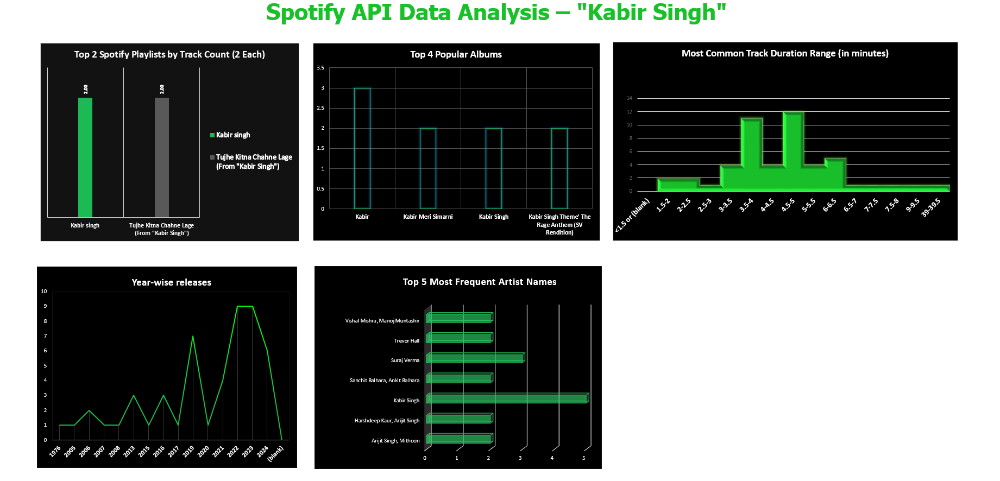

## Spotify API Data Analysis – *Kabir Singh*

An end-to-end dashboard project built using **Excel**, based on data extracted from the **Spotify Web API**.
This analysis explores tracks, albums, artist frequency, release trends, and listening insights related to the *Kabir Singh* soundtrack.

### **Dashboard Preview**

## **Project Overview**

This project analyzes *Kabir Singh* related music data collected via the **Spotify API** and visualized using **Microsoft Excel**.
It highlights patterns in track durations, album popularity, year-wise release trends, and frequently appearing artists.

## **Key Insights**

### ➜ Top Spotify Playlists

Shows the two playlists containing the highest count of *Kabir Singh* tracks.

### ➜ Popular Albums

Comparison of the most accessed albums, including the original soundtrack and variations.

### ➜ Track Duration Distribution

Histogram showing the most common duration ranges of songs.

### ➜ Year-wise Releases

Trend chart for releases across years.

### ➜ Most Frequent Artists

Bar chart of the top recurring artists in kabir singh-related playlists.

## **Tech Stack**

| Tool                                         | Purpose                   |
| -------------------------------------------- | ------------------------- |
| **Spotify Web API**                          | Data extraction           |
| **Microsoft Excel**                          | Data Cleaning             |
| **Excel (Charts, Pivot Tables, Formatting)** | Dashboard creation        |

## **How to Use**

1. Download the Excel file from this repository
2. Open in Microsoft Excel
3. Navigate to the **Dashboard** sheet
4. Explore the visuals and filters

